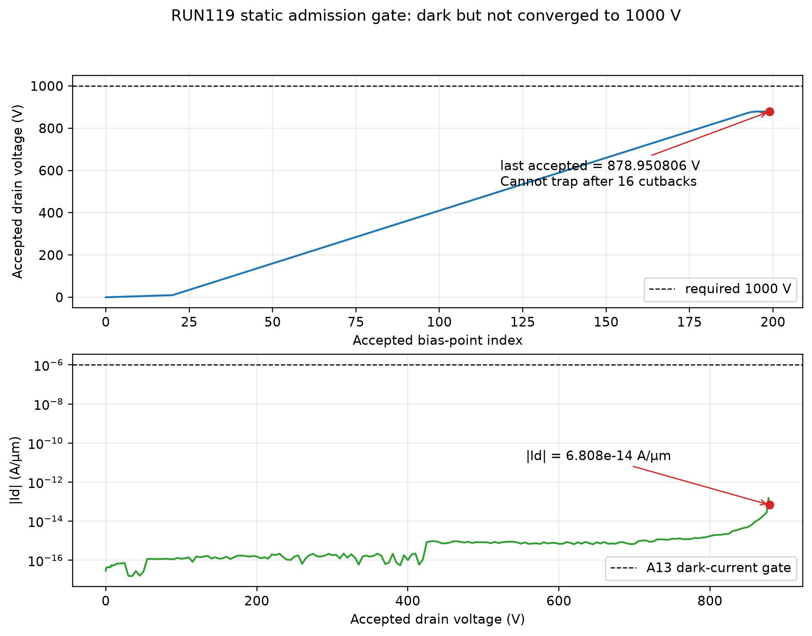

# RUN119 结果：UID donor 2× 臂在静态有效门止损

> 最终状态：**STATIC_GATE_FAIL / STOPPED_BY_A13 / NO_VALID_TRANSIENT / UID_DONOR_MAIN_CAUSE_ROUTE_CLOSED**  
> 严格限定：这是“候选无法保持冻结的 1000 V 静态准入条件”，**不是** 100/500 ns 的瞬态阴性，也不是材料击穿证明。

## 1. 本轮实际执行

- 唯一物理变量：UID n 型 donor `5.0e15 → 1.0e16 cm^-3`，厚度仍为 `0.20 µm`；
- 冻结 deck：`D:\SILVACO_LOCAL\decks\RUN119_Wang2026_nofp_Lgd9_x11_uidNd1e16_SEB_1000V_short500ns.in`；
- deck SHA-256：`55FCFAEEA7D73C54535D303A34072BE73E25BBB5A7E5D810838AED18045B1DC9`；
- 2026-07-31 23:51:31 通过标准 `/root/bin/vdoe_tmux.sh start-deck` 唯一发射一次；没有第二臂、没有重启、没有修改 solver 或物理模型。

## 2. 静态有效门实测

| A13 门 | 实测 | 裁决 |
|---|---:|---|
| 必须真实到达 `VDS=1000 V` | 最后接受解 `878.9508057 V` | **FAIL** |
| 不触发 `1.6e-5 A/µm` compliance | 末态 `|Id|=6.807961192e-14 A/µm` | PASS；失败不是过流 |
| 1000 V 暗态 `<1e-6 A/µm` | 没有 1000 V 解 | 不可判；878.95 V 很暗不能冒充 1000 V PASS |
| `Cannot trap` 不得终止 | Newton 50 次未收敛；bias cutback 16 次后 `Cannot trap` | **FAIL** |

ATLAS 在 `Cannot trap` 后仍机械执行 `save ...1000V_isothermal.str`、重开自热并进入 `SINGLEEVENTUPSET`。文件名里的 `1000V` 只是字符串，真实状态仍是 `878.9508057 V`，因此这些后续 STR 不得用于 1000 V 单粒子归因。agent 在瞬态不足 2 ps、尚未产生首个 `t2ps.str` 时精确停止同名 tmux；停止后 tmux=0、ATLAS=0。



- 轻量轨迹 CSV：`D:\SILVACO_LOCAL\outputs\runs\RUN119_wang1000-uidnd1e16-short500ns\csv\RUN119_static_gate_trace.csv`
- 绘图脚本：`D:\SILVACO_LOCAL\scripts\plot_run119_static_gate.py`

## 3. 为什么不能执行 100/500 ns 比较

`t50ns.str`、`t100ns.str`、`t500ns.str` 均不存在；源项时间积分也未完成。即使强行让错误分支跑到 500 ns，比较的也会是 RUN096 的 1000 V 对 RUN119 的 878.95 V（外部应力不同），不能回答“UID donor 翻倍是否增强持续电子丝”。因此不运行 VictoryExtract 的 RUN096/RUN119 瞬态叠图，也不生成虚假的 100/500 ns 比值。

## 4. UID donor 路线裁决

本轮裁决为：

```text
UID_DONOR_2X_STATIC_INADMISSIBLE
→ 1000 V 静态母态未保持
→ 不能进入瞬态因果门
→ 关闭 UID donor 主因路线
→ 不跑 0.5×，不继续盲扫掺杂
```

不能写成 `FALSIFIED_UID_INSUFFICIENT`，因为后者要求有效的 100/500 ns path、Id、Joule、T 数据；本轮没有这些数据。可以写的最强结论只有：**在 RUN096 的冻结结构、solver、1000 V 目标与当前模型下，把 UID donor 提到 `1e16 cm^-3` 已破坏静态准入，因而不适合作为这条生产线的持续电流主因调节轴。**

物理上，UID 正电荷增加会重排高压势垒；数值上也可能让原 Newton 分支更难延续。但暗态电流仍极低，现有证据只证明“数学分支在约 879 V 结束”，不能把它冒充雪崩、硬击穿或真实器件失效。

## 5. 归档与完整性

归档标签：`RUN119_staticgate_fail_878p950806V`。E 盘已保存 3 log + 3 STR，`skipped=0`：

- `E:\silvaco2425\bulk\log\RUN119_staticgate_fail_878p950806V__typescript`，SHA-256=`8B797F674AECDB04364AFC6D9296D82E8637C5B92B95F29C27F78EE8C9FBD261`；
- `E:\silvaco2425\bulk\log\RUN119_staticgate_fail_878p950806V__RUN119_Wang2026_nofp_Lgd9_x11_uidNd1e16_SEB_1000V_static.log`，SHA-256=`42676CF2A1F4B758820653C3CD5199825556763E62630DF9BF831DB485F29068`；
- `E:\silvaco2425\bulk\log\RUN119_staticgate_fail_878p950806V__RUN119_Wang2026_nofp_Lgd9_x11_uidNd1e16_SEB_1000V_transient.log`，SHA-256=`8F8FA644D210E959D76410DE2BC5B66CF54B947B4750FD86DD55622C4599EDA1`；
- 3 个 STR 位于 `E:\silvaco2425\bulk\str\`，分别为 mesh、isothermal、prestrike；远端原件保留。

截图 watcher 共留下 6 张三分钟桌面留痕，目录为 `D:\SILVACO_LOCAL\outputs\RUN119_uidnd1e16_short500ns_live\screenshots\`；watcher 已精确停止。
