# β-Ga₂O₃ 横向增强型 MOSFET SEB：有效进展、拟合产出与当前节点

> 审计时间：2026-08-01；证据分界：2026-07-27 09:20:00 +08:00。  
> 唯一拟合对象：Wang 2026。结论标签分为 **已实测 / 只读推断 / 待验证**。

## 1. 一句话结论

现在不是“所有工作都错了”，而是**输入层已经基本对齐，输出层还没有闭环**：最终几何、径迹位置、
网格和离子电荷已接近论文；RUN096 也形成了可重复的 1000 V 长尾基线。但论文中几十到几百 ns
持续维持 `J·E` 发热的电子导电丝没有出现，所以当前峰值温度只有 394 K，而不是论文图读约
1715 K。今天后续 RUN 的主要价值是排除了热源开关、HfO₂ 热容、Eg(T)、低场迁移率温变和
高场 F.VSATN(T) 等“看起来合理、实际效应太小”的旋钮；它们没有把主线推进到 SEB 拟合成功。

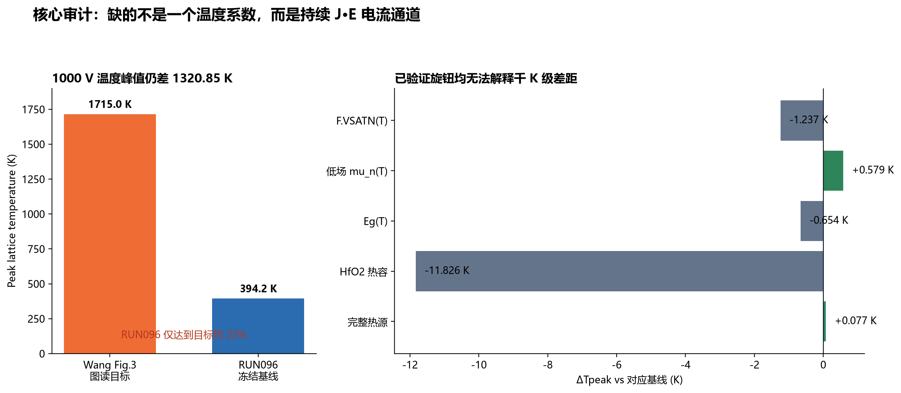

**图 1｜核心拟合缺口。** 左：Wang Fig.3 图读温度与 RUN096 峰值；右：五个单变量对峰值温度的
实测改变量。原始证据分别见 RUN094–096、RUN102/103、RUN118 的 CSV。这里的 1715 K 是图读值，
不是论文表格给出的精确数值。

## 2. “后台日志窗不见了”到底发生了什么

### 已实测

RUN095、RUN096 和 RUN119 的正式发射都走同一条
`/root/bin/vdoe_tmux.sh start-deck` 路线。这个 runner 使用 detached tmux 和真 PTY 运行
DeckBuild，本身**不会创建 xterm 窗口**。RUN095/096 留下的桌面截图前台标题实际是
`Victory Visual - RUN093_...preflight_mesh.str`，不是 RUN095/096 的求解日志。

2026-07-30 21:38 VM 重启清空了原先桌面窗口；RUN119 没有像 RUN100 那样再开一个只读 tmux
monitor，所以截图只剩裸桌面。因果链是：

`同一 detached tmux runner` → `旧桌面残留 RUN093 Victory Visual` → `VM 重启清空 GUI`
→ `RUN119 未另开 monitor` → `看起来像“后台窗口没启动”`。

这不是重连导致 RUN095/096 deck 丢失。现场 SHA 仍与发射冻结值一致：

| Deck | 当前 SHA-256 | 发射记录 |
|---|---|---|
| RUN095 | `A87F4EDDC49D4F10C149AF28A268A7CE0563AE5A7A752DD096CBF58CBB040DA6` | 一致 |
| RUN096 | `786EA68542AA235621A2A2AD13DC81CB86666FD875577F00FF1FBFA5143D7CB5` | 一致 |

### 修复方式

以后保持 tmux 正式发射不变，另开**只读监控窗**，窗口只做 `tmux attach -r` 或 tail，不启动第二个
求解器；截图看板同时抓 monitor 和空间图。这样既保留真 PTY 的稳定性，又让人能看到当前步骤。

## 3. 分界固化与“文档污染”处理

分界前最后一个可审计 Git commit 是
`540379dab74fdda861f688204b4d45ec5f59a9d2`（2026-07-27 08:31:21 +08:00）；
分界后第一个提交是 `297d947`（10:38:03）。09:20 附近没有提交，因此冻结包必须从
`540379d` 的 Git 对象读取，不能复制当前工作树的同名文件。

需要诚实说明：这个快照可称“**分界前可审计快照**”，不能声称每个字节都由 Claude 单独创作。
给定 Claude CLI JSONL 只直接证明到 02:11 左右的工作；02:19 后受限额/登录中断影响，
02:11–09:20 的 55 个核心文件变化存在混合代理来源。

当前相对分界快照共有 **209 份 Markdown 差异**被镜像到：

`D:\SILVACO_LOCAL\harness\docs\imported\post_cutoff\`

清单位于：

`D:\SILVACO_LOCAL\harness\docs\generated\post_cutoff_md_manifest.csv`

每项记录原路径、Git 状态、当前 SHA、时间和 `AUTHOR_UNVERIFIED`。它们不回灌 `skills/`，也不由
根 AGENTS 自动加载。（像把杂乱实验记录放进带编号的档案柜：没有丢掉，但不会再和实验守则贴在
同一张墙上。）

## 4. 已形成的有效产出

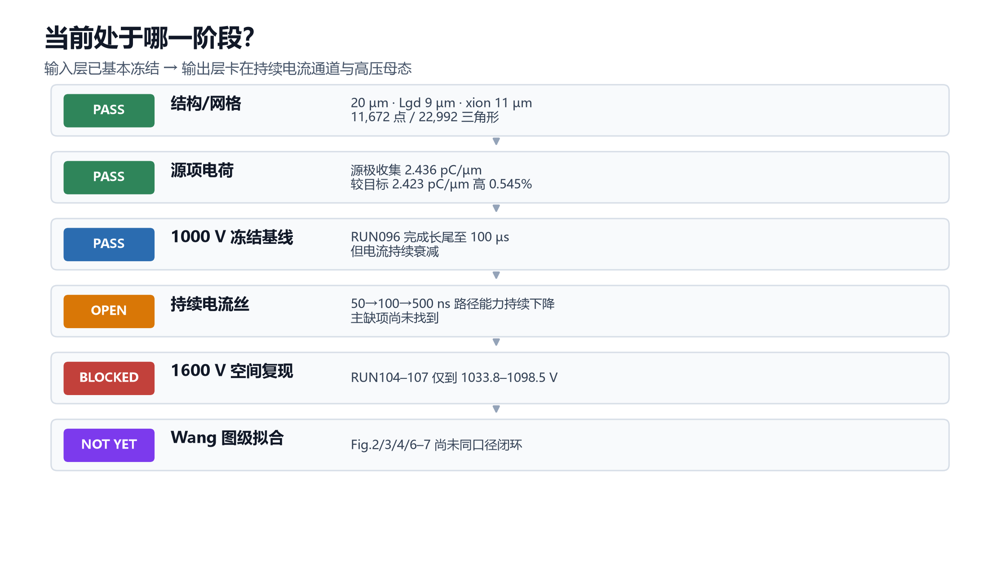

**图 2｜当前节点。** 输入层三道门已通过；主线卡在持续电流丝和高压静态母态，尚未达到论文图级拟合。

### 4.1 几何、网格和离子输入基本对齐

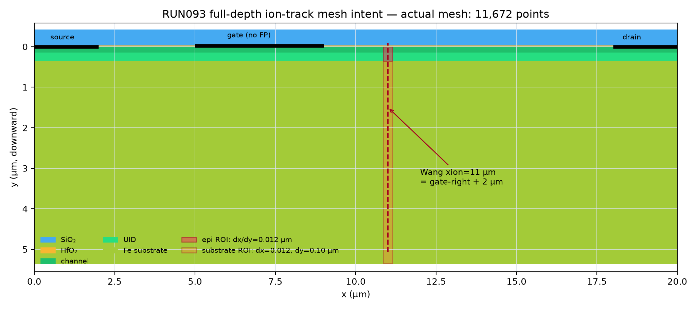

**图 3｜RUN094 最终几何/径迹网格。** 20 µm 器件、`Lgd=9 µm`、无场板、`xion=11 µm`，
11,672 点、22,992 三角形。原图：
`D:\SILVACO_LOCAL\outputs\runs\RUN094_wang1000-nofp-lgd9-x11-reference\figs\RUN094_preflight_track_mesh.png`。

RUN096 的源极收集电荷为 `2.43622 pC/µm`，相对项目目标 `2.4230 pC/µm` 高约 `0.545%`。
这说明“离子打得不够”已不是千 K 温差的首要解释。

### 4.2 RUN096 是当前冻结生产基线

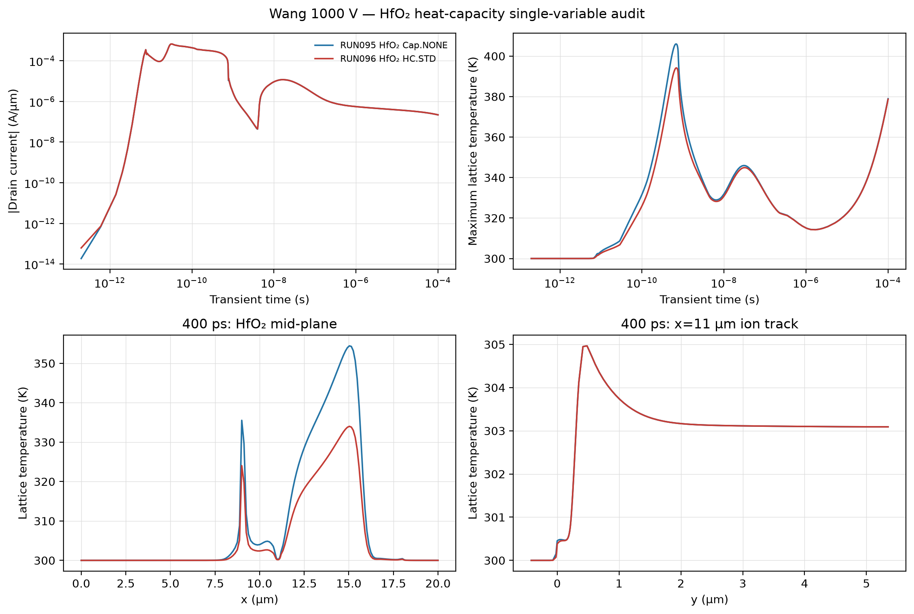

**图 4｜RUN095/096 端电流、温度与空间量对比。** 原图：
`D:\SILVACO_LOCAL\outputs\runs\RUN096_wang1000-nofp-lgd9-x11-hfo2hc\figs\RUN095_096_hfo2hc_comparison.png`。

| 指标 | RUN096 实测 |
|---|---:|
| `Id,peak` | `6.71116×10⁻⁴ A/µm @ 31 ps` |
| `Tmax,peak` | `394.152 K @ 0.686 ns` |
| `Id(50 ns)` | `5.63×10⁻⁶ A/µm` |
| `Id(100 ns)` | `2.25×10⁻⁶ A/µm` |
| `Id(500 ns)` | `6.57×10⁻⁷ A/µm` |
| `Id(100 µs)` | `2.19×10⁻⁷ A/µm` |
| `Tmax(100 µs)` | `378.681 K` |

电流从 50 → 100 → 500 ns 一路下降，说明离子暂时打开的路正在重新关门；这更像可恢复 SET，
不是论文里的持续 SEB。

### 4.3 有效负结果：哪些旋钮已经不该继续拧

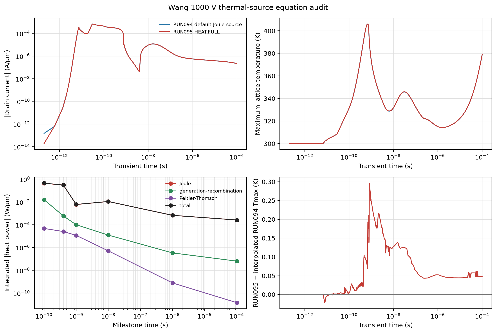

**图 5｜完整热源单变量。** RUN095 相对 RUN094 峰值温升只增加 `0.0767 K`；热源项漏开不是
1321 K 缺口的解释。原图：
`D:\SILVACO_LOCAL\outputs\runs\RUN095_wang1000-nofp-lgd9-x11-heatfull\figs\RUN094_095_heat_source_comparison.png`。

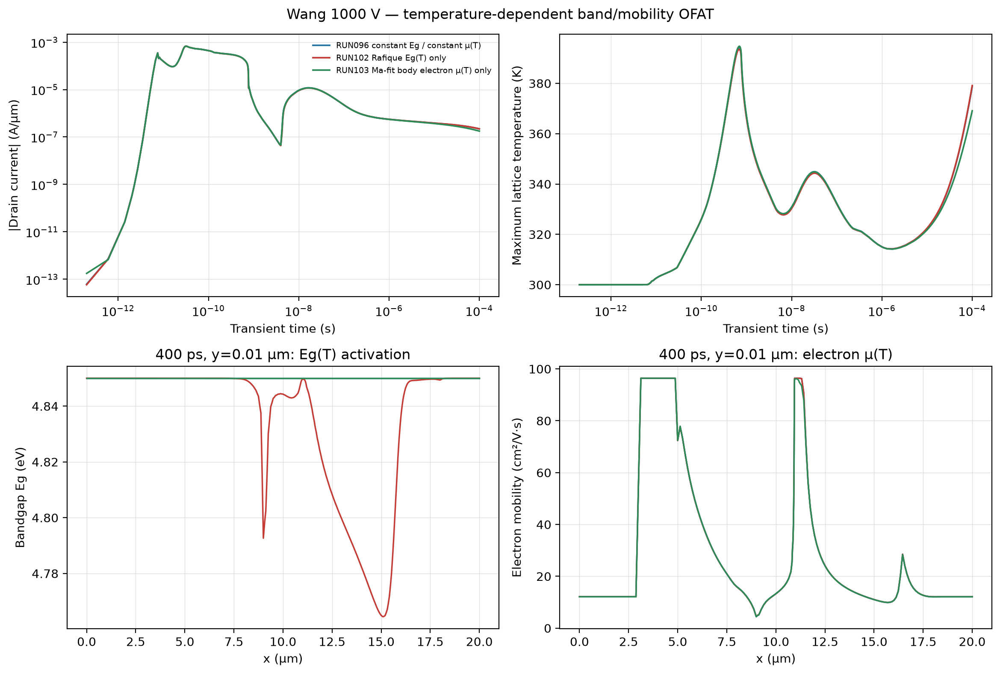

**图 6｜Eg(T) 与低场电子迁移率温变。** RUN102 `−0.654 K`，RUN103 `+0.579 K`；效应量远低于
目标差距。原图：
`D:\SILVACO_LOCAL\outputs\runs\RUN103_wang1000-nofp-lgd9-x11-mobt-ma18\figs\RUN096_102_103_tempfeedback_curves_and_parameters.png`。

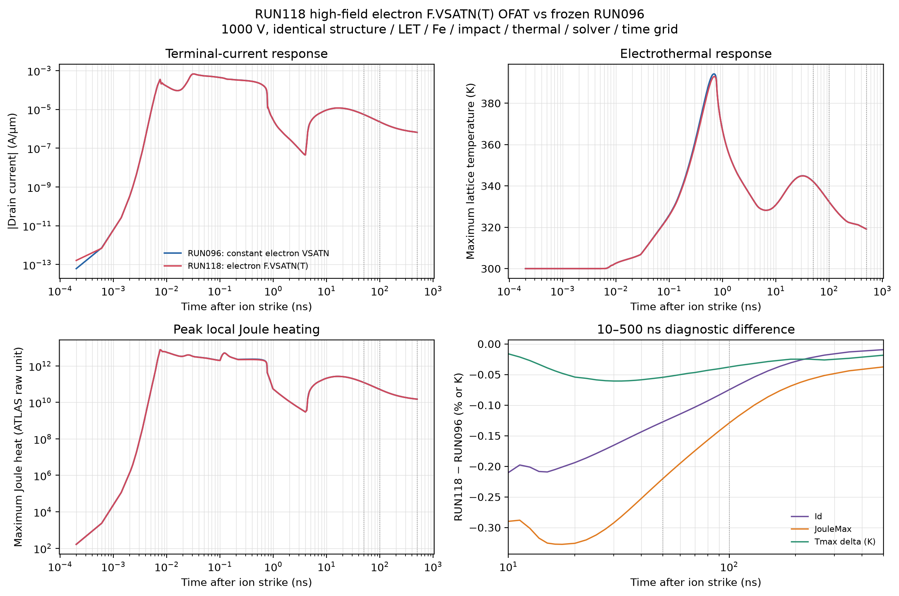

**图 7｜高场 F.VSATN(T) 单变量。** 峰值温度反而降低约 `1.237 K`，50–500 ns 电流变化不足约
`0.13%`。由于该臂出现 15 次被拒绝的 120 K 牛顿试探，它只能作为“效应量很小”的诊断，
不能写成正式模型已通过。原图：
`D:\SILVACO_LOCAL\outputs\runs\RUN118_wang1000-fvsatt-short500ns\figs\RUN096_118_fvsatn_terminal_overlay.png`。

## 5. 真正接近根因的证据：持续电流路径断了

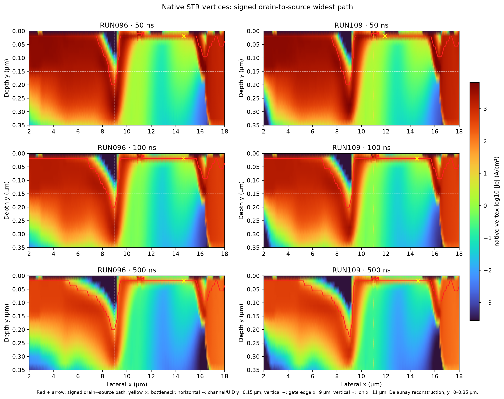

**图 8｜RUN096/109 原生顶点电子电流路径。** 路径能力从 50 → 100 → 500 ns 约
`189.7 → 62.8 → 13.6 A/cm²`，像一条被逐段掐细的水管；温度系数再强，水管本身没流量，
`J·E` 也烧不起来。原图：
`D:\SILVACO_LOCAL\outputs\reports\RUN096_109_2d_topology_20260731\figs\RUN096_109_native_vertex_paths.png`。

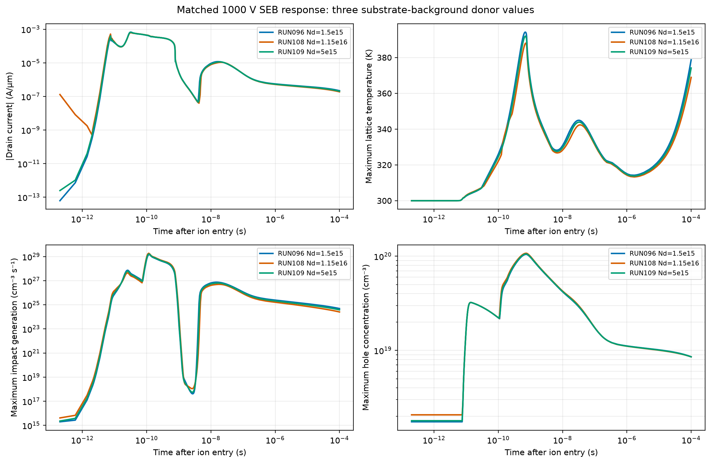

**图 9｜衬底/UID 改动的端电流响应。** 局部路径能力可增加约 17%–23%，但 100/500 ns 端电流没有
同方向持续增益 → 只是电流重新分配，没有打通完整漏—源通路。原图：
`D:\SILVACO_LOCAL\outputs\reports\RUN096_108_109_ndsub_path_overlay_20260731\figs\RUN096_108_109_terminal_curves_overlay.png`。

## 6. 当前两个准入墙

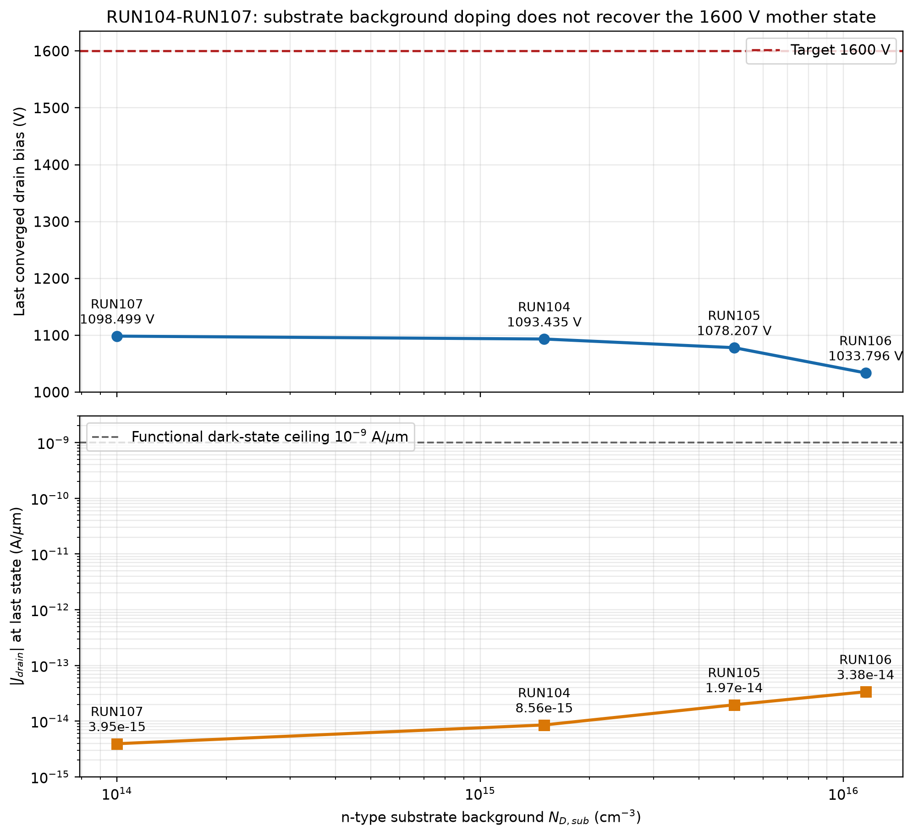

**图 10｜RUN104–107 的 1600 V 静态准入。** 四臂最后接受电压只有 `1033.8–1098.5 V`，因此没有
任何合格的 1600 V 瞬态或 Fig.6/7 空间图。原图：
`D:\SILVACO_LOCAL\outputs\reports\RUN104_107_vds_ndsub_adjudication_20260731\figs\RUN104_107_ndsub_static_reach.png`。

**图 11｜RUN119 只证明静态准入失败。** 最后接受 `878.9508057 V`、
`|Id|=6.80796×10⁻¹⁴ A/µm`，16 次折半后 `Cannot trap`；在首个 2 ps 快照前已停止，所以没有
50/100/500 ns 物理结论。原图：
`D:\SILVACO_LOCAL\outputs\runs\RUN119_wang1000-uidnd1e16-short500ns\figs\RUN119_static_gate_fail_878p950806V.png`。

合规标签只能是：`STATIC_GATE_FAIL / NO_VALID_TRANSIENT / UID_DONOR_ROUTE_CLOSED`。这里的
“路线关闭”是工程裁决（不继续盲扫），不是“UID 物理机制已被瞬态证伪”。

## 7. 有价值但不能冒充最终拟合的结果

### RUN053：阈值校准达到 0.9089 V

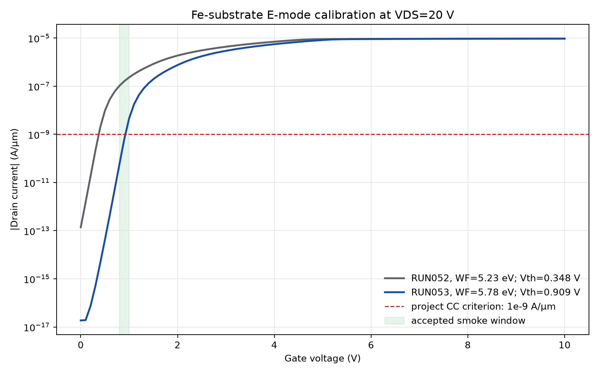

**图 12｜历史几何的功函数阈值校准。** `Vth=0.9089 V`，已接近用户要求的约 0.9 V，但不是最终
无场板/Lgd9 几何，不能直接写进最终器件表。原图：
`D:\SILVACO_LOCAL\outputs\runs\RUN053_lgd14-subfe-wf578-idvg\figs\RUN052_053_IdVg_wf_calibration.png`。

### RUN082：电压到 2707 V，但不是有效 Wang Fig.2 支路

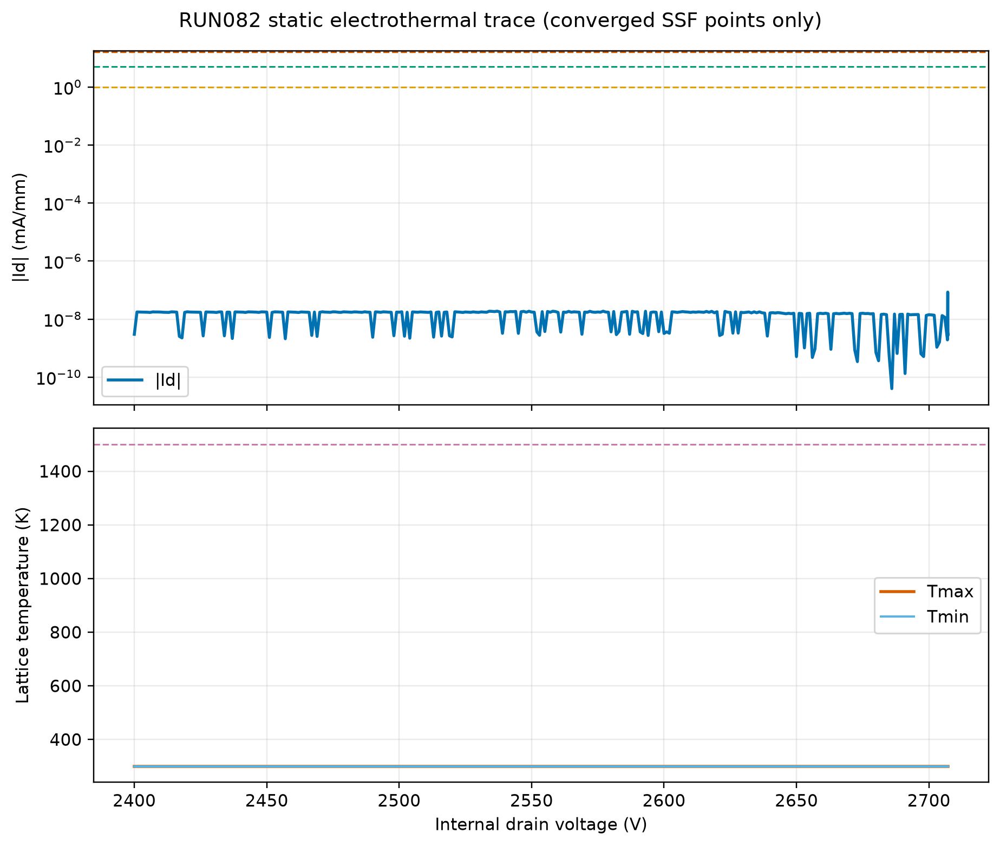

**图 13｜RUN082 静态电热。** 最后到 `2707.193 V`，但 `|Id|≈2.92×10⁻¹⁵ A/µm`、
`Tmax≈300 K`，没有论文中的 mA/mm 电流和高温支路。它证明“能把电压算到 2700 V”，不能证明
“复现了 2720 V 击穿”。原图：
`D:\SILVACO_LOCAL\outputs\runs\RUN082_wang-static-et\figs\RUN082_staticET_Id_T_vs_V.png`。

### RUN038/039/040：旧几何的 SET/数值失控参考

- RUN038/039：1200/1400 V 可到 1 µs，电流持续衰减 → 可恢复 SET 参考。
- RUN040：1500 V 在约 223.5 ns 后温度冲到约 `5×10⁴ K` 且未完成 500 ns → 数值失控，不能当
  SEB 阈值。

## 8. 与 Wang2026 的四个上下文差距

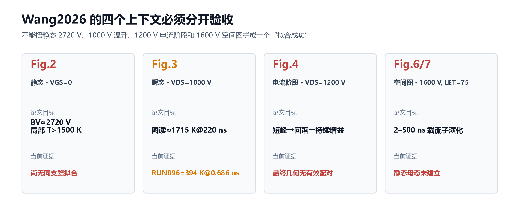

**图 14｜四个上下文必须分开验收。** 当前没有任何一项达到“论文图级闭环”。

| 论文图 | 论文条件/目标 | 当前结果 | 裁决 |
|---|---|---|---|
| Fig.2 | VGS=0；BV≈2720 V；局部温度 >1500 K | RUN082 电压接近但电流/温度支路不对 | 未拟合 |
| Fig.3 | 1000 V；图读约 1715 K@220 ns | RUN096 394.152 K@0.686 ns | 差约 1320.85 K |
| Fig.4 | 1200 V；短峰→回落→持续电流增益 | 最终几何无有效配对 | 待补 |
| Fig.6/7 | 1600 V、LET=75；2–500 ns 空间演化 | 静态母态未建立 | 阻塞 |

## 9. 对小论文框架的可用贡献

现在可以写入论文的不是“已经复现 SEB”，而是三类有证据的工作量：

1. **可复现输入链**：几何/网格/LET 电荷守恒/1000 V 长尾基线；支撑方法章和可重复性附录。
2. **系统 OFAT 排除**：完整热源、介质热容、Eg(T)、低场 μ(T)、高场 VSAT(T)、衬底/UID 路径；
   支撑“为何不能靠调一个参数复现千 K 温升”的机理审计章。
3. **二维电流路径判据**：端电流之外增加空间连通性和 `J·E` 持续性，避免把数值发散或瞬时峰
   冒充 SEB；这可以形成一条方法创新。

目前不应声称的创新是“SC-HEP 已实现加固”或“Wang 结构已复现”。这些仍是候选方案，没有配套
基线和对照图。

## 10. 下一阶段三个方案

### A. 推荐：先恢复可见反馈，再做新的“持续通道”A13

保持 RUN096 SHA 不动 → 增加只读 tmux monitor → 用 50/100/500 ns 的同色标 Je、Joule、电子浓度、
陷阱占据四时刻空间图定位断点 → 只改一个真正控制势垒/面电荷的变量。代价是先花半天补齐空间
证据，但最不容易再次盲扫。

### B. 保守：先做 1200 V 最终几何母态与瞬态配对

它直接对应 Wang Fig.4，论文价值高；风险是当前 1000 V 持续通道未打通，1200 V 可能仍只得到
可恢复 SET 或数值折半。

### C. 高风险：优先攻 1600 V 静态母态

可解锁 Fig.6/7，但 RUN104–107 已证明当前静态求解在 1.0–1.1 kV 卡住。若没有新的物理/边界证据，
继续调 solver 很可能只是在隐藏错误，不推荐作为下一枪。

## 11. 当前状态

- 远端在飞任务：`0`。
- 最近有效基线：RUN096。
- 最近实验：RUN119 静态准入失败，已停止并归档，无有效瞬态。
- 下一次实弹前置：新 A13 物理核签 + A14 四件包 + 用户核签。

